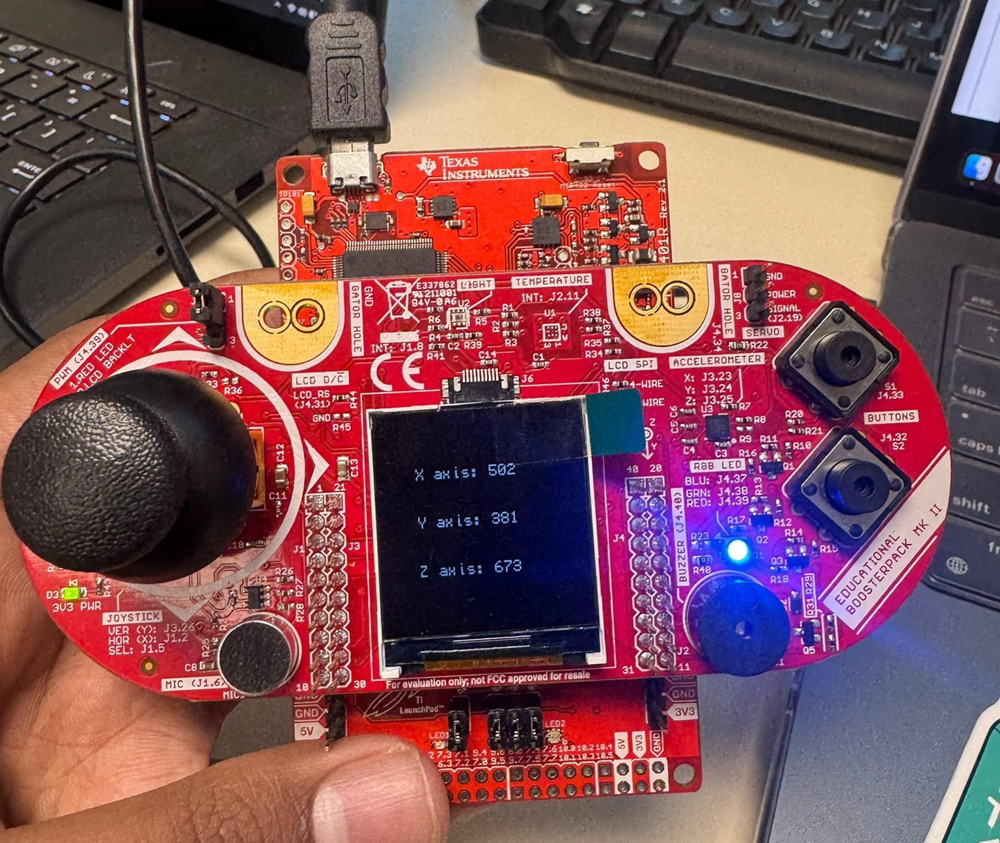
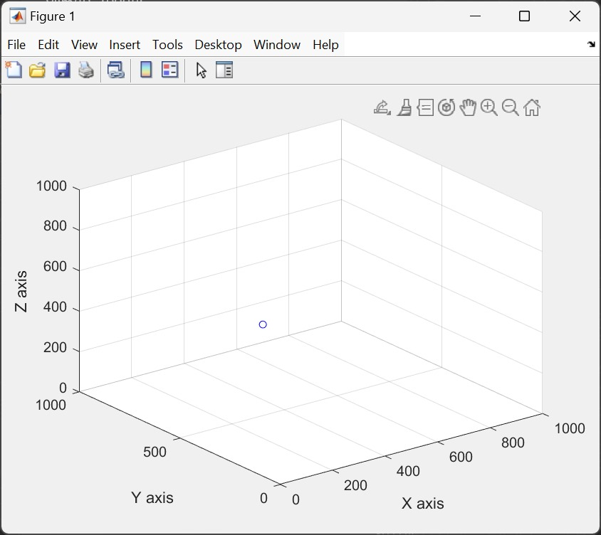

# **MSP432 Lab 2 - Accelerometer**

## **Overview**
This lab demonstrates the integration of a 3-axis accelerometer (Kionix KXTC9-2050) with the MSP432P401R microcontroller to measure and display acceleration values. The accelerometer data is displayed on the LCD screen and visualized in real-time using MATLAB. The experiment involves reading acceleration values in the x, y, and z axes, displaying them on the LCD, and plotting them in a 3D graph.

---

## **Hardware Requirements**
- **MSP432P401R LaunchPad**
- **Educational BoosterPack MKII**
- **3-Axis Accelerometer (Kionix KXTC9-2050)**
- **LCD Screen**

---

## **Software Requirements**
- **Energia IDE**
- **MATLAB**
- **MSP432 Driver Library**

---

## **Installation**
1. **Install Energia IDE**: Download and install the Energia IDE from the [official website](http://energia.nu/download/).
2. **Install MSP432 Driver Library**: Follow the instructions provided in the Energia IDE to install the necessary libraries for the MSP432 microcontroller.
3. **Install MATLAB**: Ensure MATLAB is installed on your computer for real-time data visualization.

---

## **Code Explanation**
The code is divided into two main parts:

- **Reading Accelerometer Data**: The code reads the raw analog values from the accelerometer's x, y, and z axes using the `analogRead()` function. These values are then displayed on the LCD screen using the `myScreen.gText()` function.

- **Sending Data to MATLAB**: The accelerometer values are sent to the serial monitor in the format `x, y, z` with tab separation. MATLAB reads this data, parses it, and plots it in a 3D graph using the `scatter3()` function.

---

## **Results**
The project successfully reads the accelerometer data, displays it on the LCD screen, and visualizes it in real-time using MATLAB. The 3D plot updates dynamically as the board is tilted, showing the changes in the x, y, and z axes.

 

